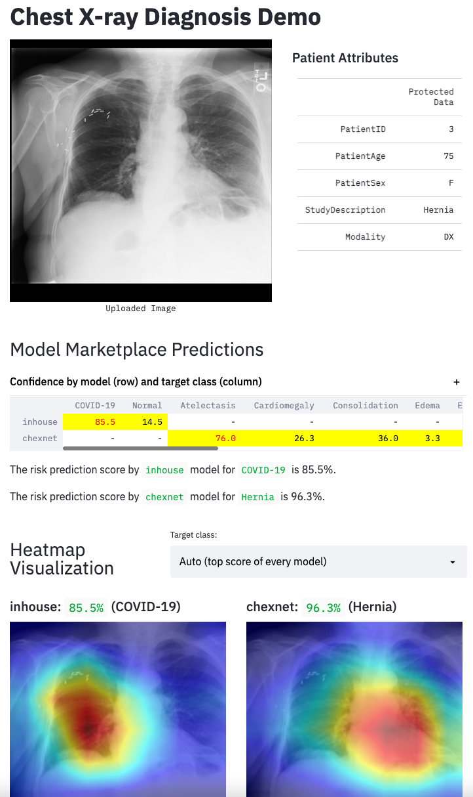

# pneumonia

COVID-19 Chest X-ray Image Classification

## Reference

Data Sources:

1. [covid-chestxray-dataset](https://github.com/ieee8023/covid-chestxray-dataset)
2. [NIH Chest X-ray dataset](https://cloud.google.com/healthcare/docs/resources/public-datasets/nih-chest)

Models:

1. [CheXNet (Stanford)](https://github.com/arnoweng/CheXNet)
2. [se_resnext50_32x4d (inhouse)](https://github.com/Cadene/pretrained-models.pytorch/blob/master/pretrainedmodels/models/senet.py)
